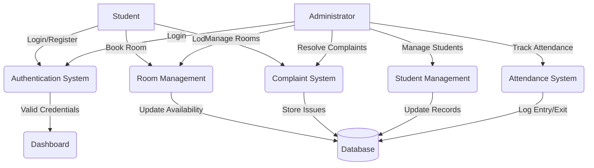
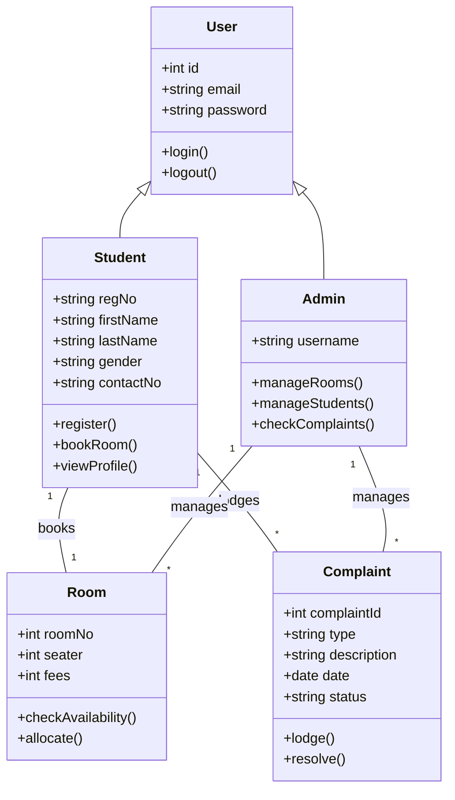
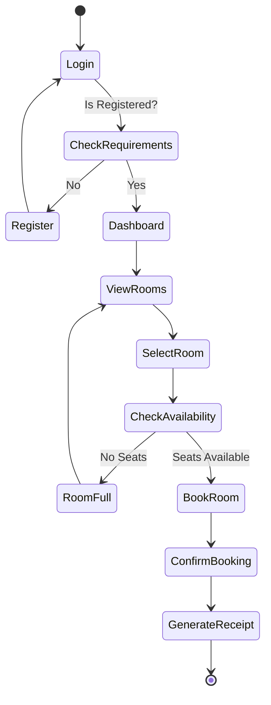
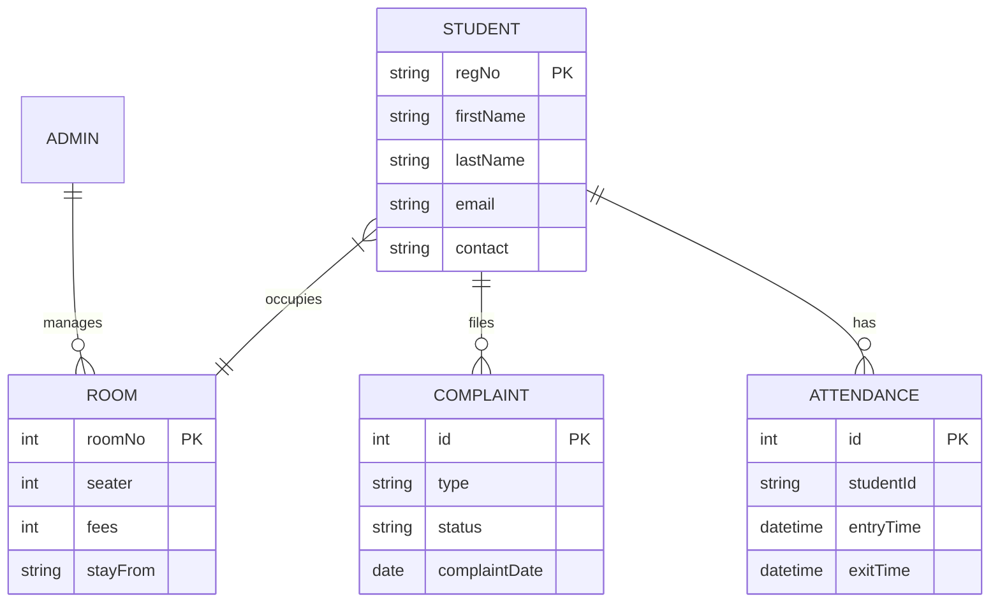

# Abstract

In the modern educational landscape, the efficient management of student accommodation is a critical component of institutional administration. The traditional methods of managing hostels often rely heavily on manual record-keeping, utilizing physical registers and spreadsheets. These manual processes are not only labor-intensive and time-consuming but are also prone to significant errors, data redundancy, and a lack of real-time accessibility. The "Hostel Management System" is a comprehensive web-based application designed to address these challenges by automating the entire spectrum of hostel operations. The primary objective of this project is to provide a seamless, digital interface for both hostel administrators and student residents, facilitating streamlined management of room allocations, student registration, fee tracking, complaint handling, and daily attendance monitoring.

The proposed system is architected using a robust technology stack, employing PHP for server-side logic and MySQL for database management, ensuring secure and efficient data handling. The frontend is developed using HTML5, CSS3, and JavaScript to deliver a responsive and user-friendly experience. Key functionalities include a dynamic dashboard for administrators to oversee hostel occupancy, manage room availability, and track student movements through an integrated attendance module. For students, the system offers a self-service portal allowing for online registration, room booking based on real-time availability, complaint submission, and profile management.

By transitioning from a manual to a digital framework, this project significantly reduces the administrative burden on hostel wardens and staff. It enhances data accuracy, ensures transparency in room allocation, and improves the overall quality of service provided to students. The implementation of this system demonstrates a practical solution to the complexities of hostel administration, offering a scalable and sustainable model for educational institutions. This report documents the complete software development lifecycle of the project, including system analysis, design specifications, implementation details, and testing methodologies, highlighting the system's feasibility and its potential to revolutionize hostel management practices.

# Table of Contents

1. [Chapter 1 – Introduction](#chapter-1--introduction)
2. [Chapter 2 – Problem Definition](#chapter-2--problem-definition)
3. [Chapter 3 – Objectives of the Study](#chapter-3--objectives-of-the-study)
4. [Chapter 4 – System Analysis](#chapter-4--system-analysis)
5. [Chapter 5 – System Design](#chapter-5--system-design)
6. [Chapter 6 – Implementation](#chapter-6--implementation)
7. [Chapter 7 – Testing](#chapter-7--testing)
8. [Chapter 8 – Output Screenshots](#chapter-8--output-screenshots)
9. [Chapter 9 – Conclusion](#chapter-9--conclusion)
10. [Chapter 10 – Future Scope](#chapter-10--future-scope)
11. [Chapter 11 – Bibliography / References](#chapter-11--bibliography--references)
12. [Chapter 12 – Appendix](#chapter-12--appendix)

# Chapter 1 – Introduction

The Hostel Management System is a web-based software application developed to manage the various activities associated with running a hostel. As educational institutions grow, the number of students requiring accommodation increases, making manual management of hostel facilities increasingly difficult and inefficient. This project aims to simplify these tasks by providing a centralized platform for managing student details, room allocations, mess facilities, and other related services. The system is designed to break the limitations of existing manual systems by offering automated, accurate, and efficient solutions for day-to-day operations. It bridges the gap between hostel authorities and students, ensuring a smooth flow of specific information and services.

The system is built to cater to the needs of both the administration and the students. For the administration, it provides tools to easily monitor room availability, track student attendance, and handle complaints efficiently. It removes the need for tedious paperwork and manual calculations, thereby reducing the chances of human error. For students, it offers a convenient way to apply for rooms, check their status, and communicate with the hostel management without the need to physically visit the office. The user interface is designed to be intuitive, requiring minimal training for users to navigate and utilize the system effectively.

## Purpose and Scope

### Purpose
The primary purpose of the Hostel Management System is to automate the administrative processes of a hostel. The core goal is to replace the traditional manual system with a computerized one that saves time, reduces work load, and provides instant access to information. It aims to create a transparent and efficient environment where data is stored securely and can be retrieved easily. The system serves as a bridge between the hostel management and the students, facilitating better communication and service delivery.

### Scope
The scope of this project is extensive, covering all major aspects of hostel management. It includes:
*   **User Management:** Module for Admin and Student login with separate privileges.
*   **Room Management:** Adding, editing, and deleting room details, and managing seat availability.
*   **Student Registration:** capturing personal, academic, and guardian details of students.
*   **Room Allocation:** Automated or manual allocation of rooms to registered students.
*   **Attendance Tracking:** Recording and monitoring student entry and exit times.
*   **Complaint Management:** A dedicated section for students to lodge complaints and for admins to resolve them.
*   **Reports Generation:** Generating various reports related to occupancy, attendance, and complaints.

This system is specifically designed for university or college hostels but can be adapted for private hostels or PG accommodations with minor modifications.

## Background Information

Historically, hostel management has been a paper-based activity. Wardens used to maintain large ledgers for student details, room inventory, fees, and attendance. This method, while functional for small numbers, becomes unmanageable as the number of students rises. Retrieving specific information, such as finding the contact details of a student's guardian in an emergency, involves searching through piles of records. This historical inefficiency drives the need for technological intervention.

Technically, the evolution of web technologies has made it possible to create robust management information systems (MIS). The shift from desktop-based applications to web-based applications allows for greater accessibility. This project leverages standard web technologies like PHP (Hypertext Preprocessor) for server-side scripting and MySQL for relational database management. PHP is chosen for its widespread use in web development and its seamless integration with HTMLvand databases. MySQL is selected for its reliability, speed, and ease of use in handling structured data. The combination of these technologies provides a solid foundation for building a scalable and secure Hostel Management System.

# Chapter 2 – Problem Definition

The definition of the problem lies in the inefficiencies and limitations inherent in the manual system of hostel management. In many institutions, the process of managing hostel facilities is still heavily reliant on physical paperwork and manual data entry. This traditional approach presents a multitude of challenges that hinder the effective administration of the facility and compromise the quality of service provided to the students.

One of the most significant issues is the **difficulty in data management and retrieval**. Information regarding student profiles, room allocation status, fee payments, and inventory is scattered across various registers or isolated files. When administrators need to access specific data—for instance, checking the vacancy status of a particular room type or retrieving the attendance record of a student—they must manually search through these physical records. This process is time-consuming and often leads to delays in decision-making and response. Furthermore, as records accumulate over time, physical storage becomes a logistical burden, and documents are prone to wear, tear, or loss.

**Data redundancy and inconsistency** are also major problems. In a manual system, the same information might be recorded in multiple places (e.g., a room allocation register, a fee register, and a student file). If a student changes their contact number or room, updating this information across all physical records is tedious. Often, updates are missed in one or more places, leading to inconsistent data. This lack of a "single source of truth" creates confusion and errors in administration. For example, a room might be shown as vacant in one register but occupied in another, leading to double-booking or underutilization of resources.

**Communication gaps** between students and the administration form another critical part of the problem. Currently, if a student has a complaint regarding facility maintenance or room issues, they must physically visit the warden's office to lodge a complaint. There is often no formal tracking mechanism for these complaints, leading to forgotten requests and student dissatisfaction. Similarly, important announcements or notices may not reach all students effectively if relying solely on notice boards.

**Attendance monitoring** is another area fraught with inefficiency. Manual roll calls are time-consuming and prone to proxy attendance. Tracking the entry and exit times of students manually in a logbook is laborious and difficult to audit. It prevents parents and authorities from having a real-time view of student safety and discipline.

Therefore, the problem is not just about the medium of record-keeping but about the systemic inefficiencies, lack of transparency, susceptibility to errors, and poor resource management that stem from non-digital processes. A technical solution is imperative to integrate these disparate functions into a cohesive, automated workflow that ensures accuracy, security, and efficiency.

# Chapter 3 – Objectives of the Study

The primary objective of this project is to develop a robust "Hostel Management System" that streamlines the daily operations of hostel administration. The specific objectives are as follows:

*   **To Automate Room Allocation:** To replace manual room assignment processes with an automated system that checks availability in real-time and prevents double-booking.
*   **To Centralize Data Management:** To create a unified database that stores all student information, room details, and administrative records, eliminating data redundancy and inconsistency.
*   **To Enhance Accessibility:** To provide a web-based interface that allows students and administrators to access the system from anywhere, facilitating remote management and self-service.
*   **To Streamline Registration:** To simplify the student registration process by allowing online application submission, reducing the need for physical paperwork and queues.
*   **To Improve Complaint Resolution:** To implement a digital complaint management module that allows students to log issues and enables administrators to track and update the status of these complaints efficiently.
*   **To Ensure Secure Access:** To implement authentication and authorization mechanisms (login/logout) to ensure that sensitive data is accessible only to authorized users (Admins and Students).
*   **To Monitor Attendance:** To provide a feature for recording and tracking student attendance, improving discipline and ensuring the safety of residents.
*   **To Generate Reports:** To enable the generation of dynamic reports regarding room occupancy, student lists, and complaint status to aid in administrative decision-making.

# Chapter 4 – System Analysis

## Existing System

The existing system for managing the hostel is largely manual or semi-automated using standalone spreadsheet applications. Daily operations such as room booking, student registration, and fee collection are handled by the hostel warden and staff using physical registers.

**Working Method:**
When a student applies for a hostel room, they fill out a physical form. The warden then manually checks the "Room Availability Register" to find a vacant spot. If available, the room is allocated, and the details are entered into the "Admission Register." Complaints are either verbal or written in a complaint book. Attendance is taken by calling out names or signing a register at the gate.

**Limitations:**
*   **Time-Consuming:** Searching for records and manual data entry takes a significant amount of time.
*   **Human Error:** There is a high probability of mistakes during data entry, such as incorrect spelling of names or assigning the same bed to two students.
*   **Data Insecurity:** Physical records can be easily lost, damaged, or accessed by unauthorized personnel.
*   **Lack of Reporting:** Generating simple reports, like a list of all students in a specific block or pending complaints, requires hours of manual compilation.

**Risks and Inefficiencies:**
The risk of data loss due to disasters (fire, water damage) is high. The system is inefficient as it relies heavily on the availability of specific staff members who hold the knowledge of where records are kept.

## Proposed System

The proposed "Hostel Management System" is a computerized web application designed to overcome the drawbacks of the existing system. It integrates all core functions into a single platform accessible via a web browser.

**System Workflow:**
The system distinguishes between two main user roles: Admin and Student.
*   **Admin:** Can manage rooms (add/delete), view all user registrations, allocate rooms, check feedback/complaints, and track student access logs.
*   **Student:** Can register an account, log in, view available rooms, book a room, view their profile, change passwords, and lodge complaints.
All data is stored in a central MySQL database, ensuring that updates (like a room being booked) are instantly reflected for all users.

**Advantages:**
*   **Efficiency:** Automates routine tasks, saving time for staff and students.
*   **Accuracy:** Validations in forms prevent invalid data entry.
*   **Transparency:** Students can see real-time room availability.
*   **Security:** Password-protected accounts ensure data privacy.
*   **Accessibility:** Being web-based, it can be accessed 24/7.

**How it solves existing problems:**
It eliminates pile-ups of files, provides instant search capabilities, reduces data redundancy, and provides a structured mechanism for complaint handling and attendance, directly addressing the chaos of the manual system.

## Feasibility Study

A feasibility study determines if the proposed system is practical and beneficial to implement.

**Technical Feasibility:**
The system is technically feasible as it uses standard, open-source technologies (PHP, MySQL, HTML, CSS, JavaScript). These technologies are mature, well-documented, and widely supported. The hardware requirements are minimal (a standard server or PC), and the client side only requires a web browser. The development team possesses the necessary skills to implement these technologies.

**Economic Feasibility:**
The cost of developing this system is low. It utilizes open-source software (XAMPP stack) which is free of licensing costs. The primary investment is in development time and standard hardware, which the institution likely already possesses. The long-term savings in terms of reduced man-hours and improved resource utilization far outweigh the initial development cost.

**Operational Feasibility:**
The system is designed with a user-friendly interface. It mimics the logical flow of the manual process (Registration -> Booking -> Management) but digitizes it. Therefore, the learning curve for the hostel staff and students will be short. No specialized training is required, ensuring high operational feasibility and acceptance.

## Requirement Specification

### Hardware Requirements

| Component | Minimum Requirement | Recommended Requirement |
| :--- | :--- | :--- |
| **Processor** | Intel Core i3 or equivalent | Intel Core i5 or higher |
| **RAM** | 4 GB | 8 GB or higher |
| **Hard Disk** | 500 GB HDD | 256 GB SSD or higher |
| **Monitor** | Standard LED Monitor | High-resolution Display |
| **Keyboard/Mouse** | Standard Input Devices | Standard Input Devices |

### Software Requirements

| Component | Specification |
| :--- | :--- |
| **Operating System** | Windows 10/11, Linux, or macOS |
| **Web Server** | Apache HTTP Server (via XAMPP/WAMP) |
| **Server-Side Scripting** | PHP (Version 7.4 or higher) |
| **Database** | MySQL / MariaDB |
| **Front-End Technologies** | HTML5, CSS3, JavaScript, Bootstrap |
| **Browser** | Google Chrome, Mozilla Firefox, or Edge |
| **IDE / Editor** | VS Code, Sublime Text, or Notepad++ |

# Chapter 5 – System Design

## Data Flow Diagram (DFD)



## Use Case Diagram

```mermaid
usecaseDiagram
    actor Student
    actor Admin

    package "Hostel Management System" {
        usecase "Login / Logout" as UC1
        usecase "Register" as UC2
        usecase "Book Room" as UC3
        usecase "View Profile" as UC4
        usecase "Lodge Complaint" as UC5
        usecase "Change Password" as UC6
        
        usecase "Manage Rooms" as UC7
        usecase "Manage Students" as UC8
        usecase "Check Availability" as UC9
        usecase "Manage Complaints" as UC10
        usecase "Track Attendance" as UC11
    }

    Student --> UC1
    Student --> UC2
    Student --> UC3
    Student --> UC4
    Student --> UC5
    Student --> UC6

    Admin --> UC1
    Admin --> UC6
    Admin --> UC7
    Admin --> UC8
    Admin --> UC9
    Admin --> UC10
    Admin --> UC11
```

## Class Diagram



## Activity Diagram (Room Booking Process)



## ER Diagram



## System Architecture Diagram

```mermaid
graph TD
    Client[Client Browser]
    Server[Web Server (Apache)]
    Engine[PHP Processing Engine]
    DB[(MySQL Database)]

    Client <-->|HTTP Request/Response| Server
    Server <-->|Script Execution| Engine
    Engine <-->|Queries/Data| DB
```

# Chapter 6 – Implementation

The implementation phase involves translating the system design into a functional software application. The project was developed using a modular approach, where distinct functionalities were built as separate modules and then integrated.

## Module Description

### 1. User Authentication Module
**Purpose:** To secure the system and ensure only authorized personnel access their respective dashboards.
**Input:** Username/Email and Password.
**Process:** The system validates the input against the encrypted passwords stored in the database using MD5 or stronger hashing algorithms.
**Output:** Access to the Admin Dashboard or Student Dashboard.

### 2. Room Management Module
**Purpose:** To allow administrators to manage room inventory.
**Process:** Admins can add new rooms, specify the number of beds (seaters), and set pricing. They can also edit or delete room details.
**Technologies:** PHP forms handle data submission to MySQL tables (`rooms` table).

### 3. Student Registration and Booking Module
**Purpose:** To enable students to register themselves and book rooms.
**Process:** Students fill in personal details, guardian info, and permanent address. Once registered, they can view available rooms and book one. The system automatically decrements the seat count for the booked room.
**Output:** A confirmed booking and a user profile.

### 4. Complaint Management Module
**Purpose:** To provide a channel for grievance redressal.
**Process:** Students select a complaint type and describe the issue. Key attributes include complaint date and status (Pending/In Process/Closed). Admins see a list of complaints and can update their status after resolution.

### 5. Attendance Management Module
**Purpose:** To track student movement.
**Process:** This module records the entry and exit times of students. It can be managed by the admin to ensure safety and discipline compliance.

## Technologies Used

*   **HTML5 (HyperText Markup Language):** Used for structuring the web pages and creating forms for data entry.
*   **CSS3 (Cascading Style Sheets):** Used for styling the user interface, improving aesthetics with layouts, colors, and fonts (e.g., Bootstrap framework for responsiveness).
*   **JavaScript / jQuery:** Used for client-side validation (e.g., checking if passwords match, ensuring fields are not empty) and dynamic interactions.
*   **PHP (Hypertext Preprocessor):** The core server-side scripting language used to handle business logic, process form data, and manage sessions.
*   **MySQL:** The relational database management system used to store all system data including user credentials, room details, and logs.

## Coding Standards
The development followed standard coding practices:
*   **Indentation:** Consistent code indentation for readability.
*   **Naming Conventions:** Meaningful variable and function names (camelCase for variables, snake_case for database columns).
*   **Security:** Prevention of SQL injection using prepared statements or sanitization functions. Use of session management for secure login states.

# Chapter 7 – Testing

Testing is a crucial phase to ensure the system is bug-free and meets the specified requirements.

## Types of Testing Performed

### Unit Testing
Individual components, such as the login function, registration form, and room availability check, were tested in isolation to ensure they produce the correct output for a given input.

### Integration Testing
Modules were combined to test their interaction. For example, testing if the "Room Booking" module correctly updates the "Room Details" in the database and reflects in the "Admin Dashboard."

### System Testing
The entire application was tested as a complete system to verify that it meets the functional and non-functional requirements. This involved end-to-end flows like a student registering, logging in, booking a room, and logging out.

### Acceptance Testing
The system was validated against the initial user requirements to ensure it solves the defined problem statements.

## Test Cases

| Test Case ID | Test Case Description | Test Data | Expected Result | Actual Result | Status |
| :--- | :--- | :--- | :--- | :--- | :--- |
| **TC_01** | Verify Admin Login | Valid User/Pass | Redirect to Dashboard | Redirected to Dashboard | **Pass** |
| **TC_02** | Verify Admin Login | Invalid User/Pass | Show Error Message | Error Message Shown | **Pass** |
| **TC_03** | specialized Student Registration | All valid fields | Account Created | Account Created | **Pass** |
| **TC_04** | Check Room Availability | Room with 0 seats | Booking Denied | Booking Denied | **Pass** |
| **TC_05** | Book Room | Valid Selection | Room Allocated, Seat -1 | Room Allocated, Seat -1 | **Pass** |
| **TC_06** | Duplicate Email Check | Existing Email | "Email already exists" | "Email already exists" | **Pass** |
| **TC_07** | Change Password | Mismatched New Pass | Error Message | Error Message | **Pass** |
| **TC_08** | Lodge Complaint | Valid Description | Complaint ID Generated | Complaint ID Generated | **Pass** |

# Chapter 8 – Output Screenshots

*(Note: In a real report, populate these sections with actual screenshots from the running application.)*

### 1. Home Page

**Description:** The landing page of the Hostel Management System showing the navigation bar and login options.
**Purpose:** Entry point for all users.

### 2. Admin Dashboard

**Description:** The central control panel for the administrator displaying key statistics.
**Purpose:** Provides a snapshot of hostel occupancy and activities.

### 3. Student Registration Form

**Description:** The interface for new students to sign up.
**Purpose:** Collects student data for the database.

### 4. Room Booking Interface

**Description:** The screen where students view and select rooms.
**Purpose:** Facilitates self-service room allocation.

### 5. Complaint Management Screen

**Description:** List of student complaints visible to the admin.
**Purpose:** Tracks and manages resolution of issues.

# Chapter 9 – Conclusion

The "Hostel Management System" project has been successfully designed and developed to address the inefficiencies of manual hostel administration. By leveraging modern web technologies like PHP and MySQL, the system establishes a centralized, automated platform for managing rooms, students, and daily operations.

**Summary of Achievements:**
The system successfully implements all core objectives. It allows for secure user authentication, distinguishing effectively between administrators and students. The room booking mechanism works in real-time, preventing the chaos of double-booking. The digital complaint registry ensures that student grievances are recorded and addressed systematically. Furthermore, the inclusion of an attendance module enhances the security framework of the hostel.

**Learning Outcomes:**
During the development of this project, significant knowledge was gained regarding the Software Development Life Cycle (SDLC). Key technical skills in database normalization, session handling in PHP, and responsive frontend design were honed. The importance of requirement analysis and feasibility studies in the early stages of a project was practically realized.

**Limitations:**
Despite its extensive features, the system has minor limitations. It currently does not integrate with the university's central fee payment gateway, requiring manual verification of fee receipts. Additionally, it is a web-based system that requires continuous internet connectivity; an offline mode is currently not available.

In conclusion, the system meets the primary needs of a modern hostel environment, offering a scalable, efficient, and user-friendly solution that significantly improves upon traditional manual methods.

# Chapter 10 – Future Scope

The current version of the Hostel Management System provides a solid foundation for digitalization, but there is always room for enhancement. The following features can be considered for future versions:

*   **Payment Gateway Integration:** Integrating online payment gateways (like Razorpay or Stripe) to allow students to pay hostel and mess fees directly through the portal, automating the financial tracking process.
*   **Mobile Application:** Developing a dedicated mobile app (Android/iOS) using frameworks like React Native or Flutter to provide students with push notifications for announcements and easier access to features.
*   **Biometric Attendance:** Integrating hardware biometric devices (fingerprint or face recognition) with the system to automate attendance marking completely, removing the need for manual administrative input.
*   **Visitor Management Module:** Adding a feature to track visitors, generating temporary gate passes, and maintaining a digital log of non-resident entries.
*   **Mess Management:** A comprehensive module for managing daily menus, stock inventory for the kitchen, and student feedback on food quality.
*   **SMS/Email Notifications:** Implementing automated alert systems to notify parents/guardians about student attendance or disciplinary issues in real-time.

# Chapter 11 – Bibliography / References

1.  **[1]** R. Elmasri and S. Navathe, *Fundamentals of Database Systems*, 7th ed. Pearson, 2016.
2.  **[2]** L. Welling and L. Thomson, *PHP and MySQL Web Development*, 5th ed. Addison-Wesley Professional, 2016.
3.  **[3]** IEEE, "IEEE Standard for Software Test Documentation," *IEEE Std 829-2008*, 2008.
4.  **[4]** W3Schools, "PHP Tutorial," [Online]. Available: https://www.w3schools.com/php/. [Accessed: Feb. 2026].
5.  **[5]** R. Nixon, *Learning PHP, MySQL & JavaScript: With jQuery, CSS & HTML5*, 5th ed. O'Reilly Media, 2018.
6.  **[6]** Mozilla Developer Network (MDN), "Web Technology for Developers," [Online]. Available: https://developer.mozilla.org.
7.  **[7]** Sommerville, Ian, *Software Engineering*, 10th ed. Pearson, 2015.
8.  **[8]** Official PHP Documentation. [Online]. Available: https://www.php.net/docs.php.

# Chapter 12 – Appendix

### A. Sample Database Schema

**Table: users**
*   id (INT, PK)
*   email (VARCHAR)
*   password (VARCHAR)
*   reg_date (TIMESTAMP)

**Table: rooms**
*   id (INT, PK)
*   room_no (INT)
*   seater (INT)
*   fees (INT)
*   posting_date (TIMESTAMP)

**Table: registration**
*   id (INT, PK)
*   roomno (INT)
*   seater (INT)
*   feespm (INT)
*   foodstatus (INT)
*   stayfrom (DATE)
*   duration (INT)
*   regno (INT)
*   firstName (VARCHAR)
*   lastName (VARCHAR)
*   gender (VARCHAR)
*   contactno (BIGINT)
*   emailid (VARCHAR)

### B. Configuration Details
*   **Localhost:** 127.0.0.1
*   **DB User:** root
*   **DB Pass:** (empty)
*   **DB Name:** hostel
